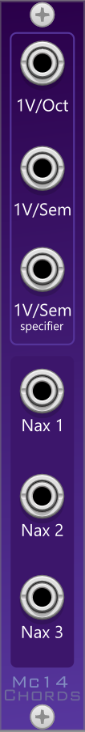

# Chords Plugin
### Generate Chords xD

https://user-images.githubusercontent.com/52451860/151708933-41446053-1ae3-469e-935c-08a96abf55cd.mp4

## Inputs
* 1V/Oct - to specify which octave where the chords will be played
* 1V/Sem - to fine tune to specify which scale to be used while playing chords
* 1V/Sem specifier - to specify which chord is to be played

## Outputs
* Nax 1,2,3 - (all are in 1V/Octave) the three tunes specifying the different notes of the chord.

---

Note, that specifier input only accepts one of the 7 notes from the given scale.  

